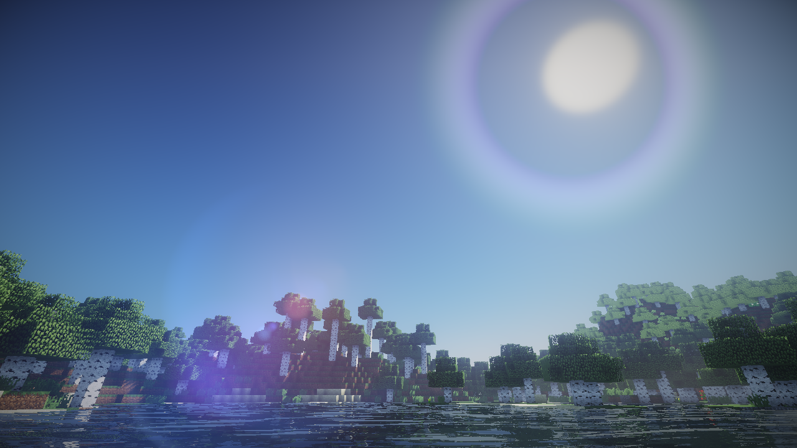

# Awesome Minecraft 

> The curated list of awesome things related to Minecraft.

[Minecraft](https://minecraft.net/) is a sandbox video game developed by Mojang. The game allows players to build with a variety of different blocks in a 3D procedurally generated world, requiring creativity from players. Other activities in the game include exploration, resource gathering, crafting, and combat.

## Contents

- [Websites](#websites)
  - [Wiki](#wiki)
  - [Forums](#forums)
- [Mod Loader](#mod-loader)
- [Forge Mods](#forge-mods)
  - [Performance](#performance)
  - [Skins And Capes](#skins-and-capes)
  - [Maps](#maps)
  - [Items Management](#items-management)
  - [Technology](#technology)
  - [Farming And Food](#farming-and-food)
  - [Energy](#energy)
  - [Utilities](#utilities)
  - [General](#general)
  - [Exploration](#exploration)
  - [Building](#building)
- [Server Plugins](#server-plugins)
- [Web Applications](#web-applications)
- [Softwares](#softwares)
  - [Libraries](#libraries)
  - [Utilities](#utilities)
  - [Launchers](#launchers)
- [Development](#development)

## Websites

### Wiki

- [Official Minecraft Wiki](https://minecraft.gamepedia.com/Minecraft_Wiki) - Minecraft Wiki is a complete resource for Minecraft, including gameplay, blocks, crafting, updates, events, mods, running a server, and resource packs.
- [Chinese Minecraft Wiki](https://minecraft-zh.gamepedia.com/Minecraft_Wiki) - The Chinese Minecraft Wiki is an official wiki of Minecraft, covering detailed tutorials on crafting, blocks, creatures and even PE versions.
- [wiki.vg](http://wiki.vg/) - Technical Minecraft wiki.

### Forums

- [Minecraft Forums](https://www.minecraftforum.net/) - Official community forums, a great place to talk about the game.
- [Planet Minecraft](https://www.planetminecraft.com/forums/) - Creative community fansite.
- [Minecraft Chinese Forum](http://www.mcbbs.net/) - Largest Chinese players community of Minecraft.

## Mod Loaders

- [Minecraft Forge](https://github.com/MinecraftForge/MinecraftForge) - Modifications to the Minecraft base files to assist in compatibility between mods.
- [Fabric](https://fabricmc.net/) - A lightweight, experimental modding toolchain for Minecraft.
- [liteloader](http://www.liteloader.com/) - A lightweight mod loader for Minecraft designed to provide simple, high-performance and reliable loader functionality for mods which don't need to modify game mechanics.
- [Meddle](https://github.com/FyberOptic/Meddle) - Everything related to modding 1.9/1.10 snapshots in one place.
- [RopeMC](https://github.com/RopeMC/RopeMC) - A lightweight, reflection based mod loader which aims to be user friendly and later version independent.

## Forge Mods

### Performance

- [Optifine](https://www.optifine.net/home) - OptiFine is a Minecraft optimization mod.
- [BetterFps](https://www.curseforge.com/minecraft/mc-mods/betterfps) - BetterFps is a Minecraft mod that add a few performance improvements.

### Skins And Capes

- [Custom Skin Loader](https://github.com/xfl03/MCCustomSkinLoader) - Custom Skin Loader for Minecraft.
- [Universal Skin Mod](https://github.com/RecursiveG/UniSkinMod) - A Minecraft Forge Mod allows players load custom skin & cape textures.

### Maps

- [Journey Map](https://minecraft.curseforge.com/projects/journeymap) - Real-time mapping in game or in a web browser as you explore.

### Items Management

- [Just Enough Items (JEI)](https://minecraft.curseforge.com/projects/jei) - JEI is an item and recipe viewing mod for Minecraft, built from the ground up for stability and performance.
- [Bibliocraft](https://www.curseforge.com/minecraft/mc-mods/bibliocraft) - Bibliocraft is a storage and organizational mod that began as a single bookcase and has expanded to so much more.
- [/dank/null](https://www.curseforge.com/minecraft/mc-mods/dank-null) - A storage mod of unreal proportions which nobody really gets. The max tier /dank/null object holds 54 slots of items which each can hold 2.14 billion items!

### Technology

- [Tinkers Construct](https://minecraft.curseforge.com/projects/tinkers-construct) - Tinkers' Construct is a mod about putting tools together in a wide variety of ways, then modifying them until they turn into something else.
- [Immersive Engineering](https://minecraft.curseforge.com/projects/immersive-engineering) - Immersive Engineering is a tech mod with a certain charm, based on the ideas and concepts, and with most assets created by Damien Hazard.
- [Botania](https://github.com/Vazkii/Botania) - Botania is a tech mod in essence. The theme is natural magic.
- [Thermal Foundation + Dynamics + Expansion](https://minecraft.curseforge.com/projects/thermalexpansion) - A server-friendly and content-rich blend of magic and technology! Title is three different mod names, but of the same series and usually played together.
- [Railcraft](https://github.com/Railcraft/Railcraft) - Greatly expand and improve the Minecart system in Minecraft.
- [Actually Additions](https://www.curseforge.com/minecraft/mc-mods/actually-additions) - Actually Additions is a technology mod that adds various utilities like multitools, item magnets, atomic reconstructors and so on.
- [Applied Energistics 2](https://github.com/AppliedEnergistics/Applied-Energistics-2) - A Minecraft Mod about Matter, Energy and using them to conquer the world. Mainly focused on item storage.
- [Draconic Evolution](https://www.curseforge.com/minecraft/mc-mods/draconic-evolution) - One of the best tech mod there is, but really overpowered in the late game. Adds things like a Draconic Power Core which no one has been able to fill yet...
- [Ender IO](https://www.curseforge.com/minecraft/mc-mods/ender-io) - A large ender themed mod, that just adds lots of new fun things.
- [Galacticraft](https://micdoodle8.com/mods/galacticraft) - A mod that adds rockets and new planets to explore. Expandable with addons.
- [OpenComputers](https://ocdoc.cil.li) - OpenComputers is a mod that adds computers and robots into the game, which can be programmed in Lua 5.3.
- [ComputerCraft](https://www.computercraft.info) - Adds computers based on Lua (5.2 and 5.3) into Minecraft.
- [WarpDrive](https://www.curseforge.com/minecraft/mc-mods/warpdrive) - Adds Star Trek and other franchise like ships, weapons, transporters and so on into the game. Also adds new planets (dimensions).

### Farming And Food

- [Pam's HarvestCraft](https://minecraft.curseforge.com/projects/pams-harvestcraft) - Pam's HarvestCraft is a mod for Minecraft that currently adds many kinds of crops and food.
- [AgriCraft](https://www.curseforge.com/minecraft/mc-mods/agricraft) - A mod that adds a more sophisticated crop system, like the ability to have genetic mutations and also adds more crops.
- [Bonsai Trees](https://www.curseforge.com/minecraft/mc-mods/bonsai-trees) - Adds essentially mini tree farms which are one block big.
- [Ex Nihilo: Creatio](https://www.curseforge.com/minecraft/mc-mods/ex-nihilo-creatio) - A great mod for skyblocks, it filters things like sand and gravel for useful resources like iron and diamond, compatible with lots of mods.

### Energy

- [RFTools](https://minecraft.curseforge.com/projects/rftools) - RFTools is a mod containing various tools that are related to RF (Redflux) or technology in general.
- [Extreme Reactors](https://www.curseforge.com/minecraft/mc-mods/extreme-reactors) - Adds nuclear reactors with the fictional fuel 'yellorium'. A carry on of the original Big Reactors.
- [Zetta Industries](https://www.curseforge.com/minecraft/mc-mods/zetta-industries) - A mod which adds the main multiblock of a big battery.
- [Applied Energistics 2](https://github.com/AppliedEnergistics/Applied-Energistics-2) - A Minecraft Mod about Matter, Energy and using them to conquer the world.

### Magic

- [AbyssalCraft](https://www.curseforge.com/minecraft/mc-mods/abyssalcraft) - AbyssalCraft is a magic mod centered around exploration.
- [Astral Sorcery](https://www.curseforge.com/minecraft/mc-mods/astral-sorcery) - This is a magic mod based on the stars, and harnessing the powers of starlight and the constellations.
- [Avaritia](https://www.curseforge.com/minecraft/mc-mods/avaritia) - Avaritia is a mod with a really long progression tree, but really overpowered in the late game. Its soul purpose is to drag the endgame gameplay to extreme lengths.
- [Blood Magic](https://www.curseforge.com/minecraft/mc-mods/blood-magic) - This is a magic mod based on blood. Beware, you die a lot.

### Utilities

- [TNTUtils](https://github.com/ljfa-ag/TNTUtils) - More control over explosions in Minecraft.
- [Akashic Tome](https://www.curseforge.com/minecraft/mc-mods/akashic-tome) - A mod based on Morph-o-Tool, which mainly gives the ability to merge different mods' documentation books.
- [AppleSkin](https://www.curseforge.com/minecraft/mc-mods/appleskin) - This mod does not change any existing mechanics, but simply makes the existing hunger saturation and exhaustion levels visible in the default GUI.
- [Attribute Fixer](https://www.curseforge.com/minecraft/mc-mods/attributefix) - This mod fixes the attribute system in Minecraft which handles things like armour points, because many other mods are inadvertantly affected by a limit in this system.
- [Diet Hopper](https://www.curseforge.com/minecraft/mc-mods/diet-hoppers) - This mod modifies the way Minecraft calculates the collision boxes of the hopper, so that you can access any visible blocks behind it.
- [FoamFix](https://www.curseforge.com/minecraft/mc-mods/foamfix-optimization-mod) - Fixes various aspects of the Minecraft code, generally making the game faster.

### General

- [ArmorPlus](https://www.curseforge.com/minecraft/mc-mods/armorplus) - This mod literally adds tons of armors to the game, and different ways of crafting them.
- [Baubles](https://www.curseforge.com/minecraft/mc-mods/baubles) - This mod adds seven new slots to the player inventory which can be fitted with various items like amulets, belts, rings and so on added by other mods.

### Exploration

- [Aroma1997's Dimensional World](https://www.curseforge.com/minecraft/mc-mods/aroma1997s-dimensional-world) - This mod adds one extra dimension, with the intended purpose of mining, meaning the Overworld will not be filled up with things like Buildcraft quarry holes anymore etc.
- [Twilight Forest](https://www.curseforge.com/minecraft/mc-mods/the-twilight-forest) - Adds a new twilight forest dimension with new sturctures, bosses, and quests to complete.

### Building

- [Carpenter's Blocks](https://www.curseforge.com/minecraft/mc-mods/carpenters-blocks) - This mod adds new blocks such as slants and corners which can be made to look like any other block in the game! Extremely useful for artistic builds. (For 1.12+ see BlockCraftery)
- [Chisel](https://www.curseforge.com/minecraft/mc-mods/chisel) - This mod adds multiple new textures to lots of blocks in the game, adding a wide variety of textures. (For editing units smaller than blocks see Chisel and Bits.)
- [WorldEdit](https://github.com/EngineHub/WorldEdit) - WorldEdit is an open source in-game map editor available for Bukkit, Forge, MinecraftEdu, and many other platforms.
- [FAWE](https://intellectualsites.github.io/download/fawe.html) - Stands for Fast Async WorldEdit. Based upon WorldEdit, it is simply faster, and adds lots more tools (i.e. brushes) to work with.

## Server Plugins

- [AntiCheatReloaded](https://github.com/Rammelkast/AntiCheatReloaded) - AntiCheatReloaded helps server admins easily identify and block malicious users by monitoring and analyzing the behaviour of their players.
- [ViaVersion](https://github.com/MylesIsCool/ViaVersion) - Allows the connection of newer clients to older server versions for Minecraft servers.
- [AdvancedKitsReloaded](https://github.com/TryHardDood/AdvancedKitsReloaded) - AdvancedKitsReloaded is a Kit managing plugin for Minecraft servers which runs Bukkit, CraftBukkit, Spigot and Paper (>1.8). With this plugin you can easily create/edit/delete your kits and you can customize it as much as you'd like.
- [WorldGuard](https://github.com/EngineHub/WorldGuard) - WorldGuard lets you and players guard areas of land against griefers and undesirables, as well as tweak and disable various gameplay features of Minecraft.
- [CraftBook](https://github.com/EngineHub/CraftBook) - CraftBook lets you create magically extending bridges, compact Redstone circuits, complex Minecart mechanics, and much more — all without a client mod and fully customizable by the server.

## Web Applications

- [Blessing Skin Server](https://github.com/bs-community/blessing-skin-server) - A web application brings your custom skins back in offline Minecraft servers.
- [yoshino](https://github.com/idawnlight/yoshino) - A lite & fast Minecraft skin server, written in php. ([Live Demo](https://skin.lim-light.com/))
- [WorldEdit Golf](https://worldedit.golf/) - Challenge others in a competition to use WorldEdit in as few commands as possible.

## Softwares

### Libraries

- [CraftLib](https://github.com/zerite/craftlib) - Complete [Kotlin](https://kotlinlang.org) / Java library for wrapping the entire Minecraft codebase, including protocol, NBT, schematics, chat and more. 
- [MCProtocolLib](https://github.com/Steveice10/MCProtocolLib) - A simple library for communicating with a Minecraft client/server, written in Java.
- [node-minecraft-protocol](https://github.com/PrismarineJS/node-minecraft-protocol) - A NodeJS library to parse and serialize minecraft packets, plus authentication and encryption.

### Utilities

- [Minecraft Command Helper](https://github.com/IceLitty/Minecraft-Command-Helper) - A WPF Program about generate Minecraft Command (with NBT data). (Windows Only)
- [Minecraft Command Science](https://minecraftcommand.science/) - Several Minecraft vanilla JSON generators.
- [Amidst](https://github.com/toolbox4minecraft/amidst) - Display an overview of a Minecraft world, without actually creating it.

### Launchers

- [MultiMC](https://github.com/MultiMC/MultiMC5) - A custom launcher for Minecraft that allows you to easily manage multiple installations of Minecraft at once.
- [HMCL](https://github.com/huanghongxun/HMCL) - A powered Minecraft launcher that supports a lot of features.

## Development

- [FML Mod Development Tutorial](https://fmltutor.ustc-zzzz.net/) - (Chinese) Minecraft 1.8.9 FML Mod Development Tutorial.
- [SchematicWebViewer](https://github.com/EngineHub/SchematicWebViewer) - A JavaScript/TypeScript library for rendering and viewing Minecraft schematic files on the web.

## License

